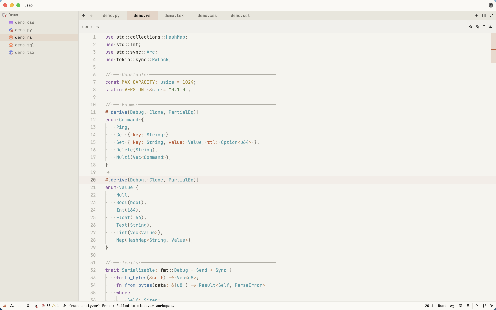

# Claude+

A color theme inspired by Anthropic's **Claude** color scheme and design language, ported to multiple editors and apps. Every port shares one palette: the same warm clay accent (`#D97757` dark / `#C15F3C` light), the same paper-and-ink backgrounds, the same muted syntax colors.

Each theme ships in both a **Dark** and a **Light** variant.

## Light



## Dark


## Platforms

| Platform | Location | Install |
| --- | --- | --- |
| Zed | [`zed/`](./zed) | [zed/README.md](./zed/README.md) |
| VS Code | [`vscode/`](./vscode) | [vscode/README.md](./vscode/README.md) |
| Obsidian | [`obsidian/`](./obsidian) | [obsidian/README.md](./obsidian/README.md) |

## Palette

| Role | Dark | Light |
| --- | --- | --- |
| Background | `#1E1D1B` | `#FAF9F5` |
| Editor background | `#1E1D1B` | `#F5F4EF` |
| Surface / panel | `#2E2D2A` | `#E8E6DC` |
| Border | `#3A3832` | `#DAD8D0` |
| Text | `#F1F0EC` | `#141413` |
| Muted text | `#B0AEA5` | `#6E6C64` |
| Accent | `#D97757` | `#C15F3C` |
| Red | `#D07277` | `#C24E4E` |
| Green | `#8FA876` | `#598050` |
| Yellow | `#D4B06A` | `#A88C30` |
| Blue | `#6A9BCC` | `#4A7DA8` |
| Purple | `#B07CC5` | `#8C5BA0` |
| Cyan | `#6EB4BF` | `#4A9AA5` |

## Repository layout

```
zed/        Zed extension (extension.toml + themes/)
vscode/     VS Code extension (package.json + themes/)
obsidian/   Obsidian theme (manifest.json + theme.css)
screenshots/
```

## Contributing

Changing a color? Change it in the palette table above and in all three ports, so they stay in sync.

## License

[MIT](./LICENSE) © Nick Rohner
