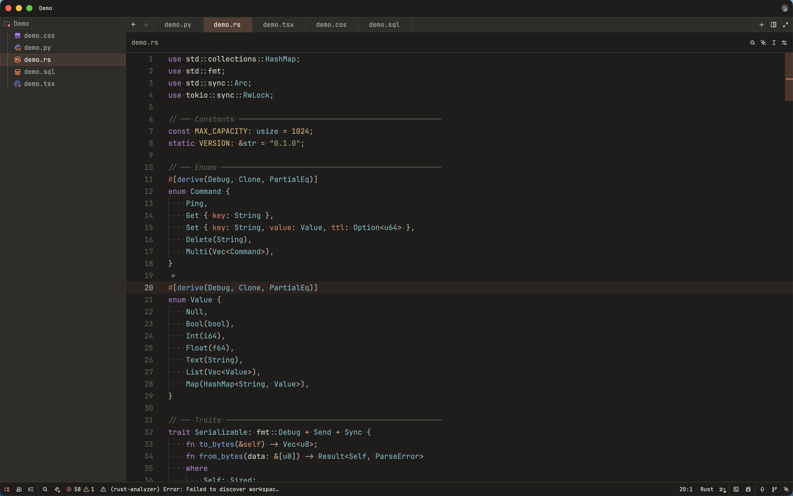

# Claude+ for VS Code

A Claude inspired theme for Visual Studio Code. Ships **Claude+ Dark** and **Claude+ Light**.



## Install

**From the Marketplace**

1. Open Extensions (`cmd-shift-x`), search for **Claude+**, install.
2. `cmd-k cmd-t` → pick **Claude+ Dark** or **Claude+ Light**.

**Manually**

Copy this `vscode/` directory into your extensions folder as `claude-plus`, then restart VS Code:

- macOS / Linux: `~/.vscode/extensions/claude-plus`
- Windows: `%USERPROFILE%\.vscode\extensions\claude-plus`

**Developing on it**

Open this `vscode/` directory in VS Code and press `F5` to launch an Extension Development Host with the theme loaded. Edits to the theme JSON apply live.

## Files

```
package.json                              extension manifest (contributes.themes)
themes/claude-plus-dark-color-theme.json
themes/claude-plus-light-color-theme.json
```

Each theme file has three sections: `colors` (workbench UI), `tokenColors` (TextMate scopes), and `semanticTokenColors` (language-server tokens).

## Publishing

```sh
cd vscode
npx @vscode/vsce package        # → claude-plus-1.0.0.vsix
npx @vscode/vsce publish        # needs a Personal Access Token
```

Bump `version` in `package.json` first. `vsce` packages the directory it runs in, so the subfolder layout is fine.
